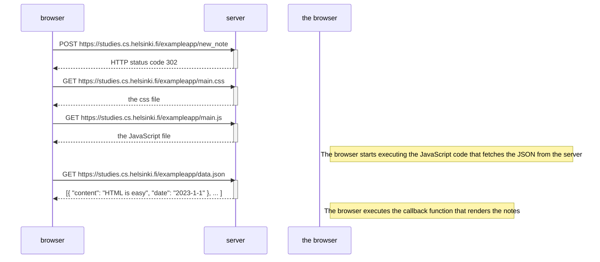
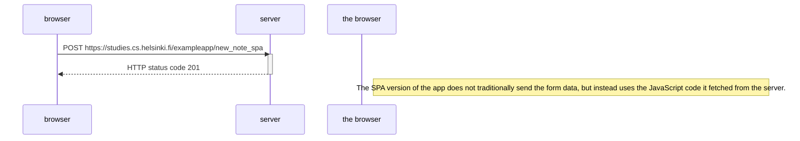

<!--  0.4: New note diagram

Create a similar diagram depicting the situation where the user creates a new note on the page https://studies.cs.helsinki.fi/exampleapp/notes by writing something into the text field and clicking the submit button.

If necessary, show operations on the browser or on the server as comments on the diagram.

The diagram does not have to be a sequence diagram. Any sensible way of presenting the events is fine.

-->



<!-- 0.5: Single page app diagram
Create a diagram depicting the situation where the user goes to the single-page app version of the notes app at https://studies.cs.helsinki.fi/exampleapp/spa. -->



<!-- 0.6: New note in Single page app diagram
Create a diagram depicting the situation where the user creates a new note using the single-page version of the app.

This was the last exercise, and it's time to push your answers to GitHub and mark the exercises as done in the submission system. -->

```mermaid

```

sequenceDiagram
participant browser
participant server

    browser->>server: POST https://studies.cs.helsinki.fi/exampleapp/new_note_spa
    activate server
    server-->>browser: HTTP status code 201
    deactivate server

    Note right of the browser: The code determines that the data is to be sent with an HTTP POST request and the data type is to be JSON. The data type is determined with a Content-type header. Then the data is sent as JSON string.
